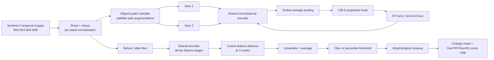
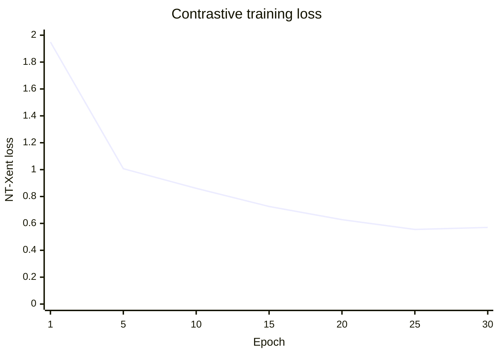
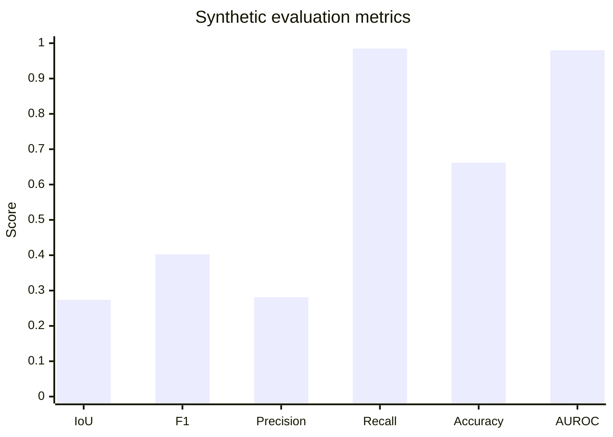
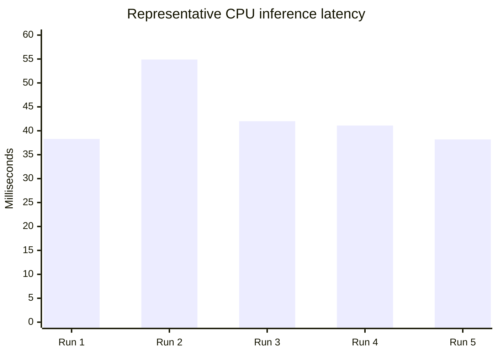

# Self-Supervised Satellite Change Detection

An end-to-end PyTorch pipeline that learns Sentinel-2 representations from **unlabelled imagery** with temporal contrastive pretraining, then detects change by comparing dense feature maps. Human labels are not required for training; optional masks are used only for evaluation and threshold calibration.

**Repository version:** `0.1.0` (defined in `pyproject.toml` and `src/sat_change/__init__.py`)

## The Problem

Satellite change detection is useful for monitoring construction, land-use transitions, agriculture, and environmental events, but pixel-level labels are expensive and difficult to maintain across locations and seasons. This project provides a label-efficient baseline: it learns from temporal satellite imagery alone, produces dense change maps for registered image pairs, and supports both offline synthetic data and real Sentinel-2 L2A scenes.

The value is an inspectable, reproducible workflow rather than a black-box prediction service. It includes ingestion, normalization, self-supervised training, tiled inference, unsupervised thresholding, geospatial output, and evaluation against masks when they are available.

## The Architecture



The encoder is fully convolutional: a stem followed by three downsampling stages with widths `32 -> 64 -> 128 -> 256`. Its intermediate feature maps retain spatial information. During inference, distances between before/after features from all three stages are resized to the input resolution and averaged, which balances local detail with broader context.

## Engineering Trade-offs

- **Compact CNN instead of a large pretrained backbone:** the repository favors a small, dependency-light encoder that can train offline on modest hardware and preserve dense feature stages. A larger ResNet or transformer could improve transfer performance, but would add compute, memory, and pretrained-weight assumptions.
- **Self-supervised NT-Xent instead of supervised segmentation:** paired augmented views make it possible to use unlabelled imagery. This removes annotation cost, at the expense of requiring careful temporal registration and producing a threshold-sensitive anomaly score rather than a directly supervised class probability.
- **Multiscale cosine distance instead of raw pixel differencing:** feature distance is less sensitive to small spectral and appearance changes than pixel subtraction while retaining spatial detail. The trade-off is additional encoder passes and dependence on the quality and domain coverage of pretraining.
- **Tiled inference with overlap blending:** large scenes are processed without requiring a full-scene tensor in memory. Overlap reduces tile-edge artifacts, while increasing runtime compared with one fully convolutional pass.
- **AdamW with cosine learning-rate decay:** this is a stable default for contrastive pretraining and avoids hand-tuned step schedules. It does not guarantee the best result for every biome, so scene-level validation remains important.
- **Unsupervised thresholding:** Otsu/percentile thresholds keep inference label-free, but thresholds can vary with season, sensor conditions, and scene content. For operational use, calibrate on a representative validation region.

## Performance Metrics

The figures below are generated from locally produced artifacts under `outputs/`. Those generated files are ignored by Git, so rerun the documented demo/training commands to reproduce them. They are representative synthetic-data results, not a claim of production accuracy.

### Training loss

Thirty-epoch run from `outputs/pretrain_30ep/history.json` (NT-Xent loss; lower is better):



### Detection quality

Mean over eight synthetic scenes from `outputs/vegas_30ep.json`:



| Metric | Mean |
| --- | ---: |
| IoU | 0.274 |
| F1 | 0.403 |
| Precision | 0.281 |
| Recall | 0.985 |
| Accuracy | 0.662 |
| AUROC | 0.980 |

The high recall and lower precision indicate that the default threshold favors finding changed pixels and produces false positives on several scenes. Scene-level metrics, rather than patch-level metrics, should be used for comparisons.

### Latency

A five-run CPU benchmark on one `128 x 128` synthetic pair using `outputs/pretrain_30ep/best.pt`, `tile_size=512`, `overlap=32`, and PyTorch `2.13.0+cpu` measured **42.9 ms mean latency** (38.2 ms minimum). Latency depends on image dimensions, tile count, CPU/GPU, and PyTorch version.



### Hardware power consumption

Power telemetry is **not currently recorded by this repository**, so no wattage graph is included and no consumption value should be inferred from the latency benchmark. Measure the target machine separately (for example with GPU power telemetry or an external power meter) and report the device, workload, sampling interval, and average/peak watts alongside the latency results.

## What is implemented

- GeoTIFF/NumPy Sentinel-2 ingestion with per-band robust normalization and nodata masking.
- Spatially aligned temporal-pair sampling and satellite-safe augmentation.
- SimCLR/NT-Xent self-supervised pretraining with a convolutional encoder.
- Dense, multiscale feature-distance change maps.
- Unsupervised thresholding (Otsu or percentile) and morphological cleanup.
- Evaluation with IoU, F1, precision, recall, AUROC and average precision.
- Tiled inference for large scenes with overlap blending and GeoTIFF output.
- Synthetic paired-scene generator and tests for a fully reproducible smoke run.
- On-demand fetch of real Sentinel-2 L2A pairs from Microsoft Planetary Computer (`scripts/fetch_sentinel2.py`).

## Data layout

Each acquisition is a multiband `.tif`/`.tiff` or `.npy` array (`C,H,W`). Files with the same scene key and different dates form temporal pairs:

```text
data/
  train/
    amazon_2023-01-12.tif
    amazon_2023-08-20.tif
    dubai_2023-02-01.tif
    dubai_2024-02-03.tif
```

The default filename parser removes a trailing `YYYY-MM-DD` or `YYYYMMDD` to obtain the scene key. A CSV manifest can instead contain `path,scene,date,split`.

Recommended Sentinel-2 L2A bands at 10 m are `B02,B03,B04,B08`. Resample other bands before stacking. Reflectance may be stored as `0..1` or Sentinel integer scale (`0..10000`); both are handled.

## Install

Python 3.10+ is recommended.

```bash
python -m venv .venv
# Windows: .venv\Scripts\activate
source .venv/bin/activate
pip install -e ".[geo,test]"
```

## Quick start

Generate deterministic synthetic imagery (including evaluation masks):

```bash
python scripts/make_synthetic.py --output data/synthetic --scenes 12 --size 128
```

Pretrain on all single-date images:

```bash
python -m sat_change.train --data data/synthetic/images --output outputs/pretrain --epochs 10 --batch-size 32
```

Run change detection on a registered pair:

```bash
python -m sat_change.predict \
  --before data/synthetic/images/scene000_20230101.npy \
  --after data/synthetic/images/scene000_20240101.npy \
  --checkpoint outputs/pretrain/best.pt \
  --output outputs/scene000_change.npy
```

Evaluate all synthetic pairs:

```bash
python -m sat_change.evaluate \
  --images data/synthetic/images \
  --masks data/synthetic/masks \
  --checkpoint outputs/pretrain/best.pt \
  --output outputs/metrics.json
```

For a one-command end-to-end demo, run `python scripts/demo.py`. The demo automatically detects whether real satellite data exists in `data/real/` with ground-truth masks; if so, it uses that, otherwise it generates synthetic data. Use `--real` to force real data or `--synthetic` to force synthetic.

```bash
# Auto-detect (real if available, else synthetic)
python scripts/demo.py

# Force real satellite data (requires data/real/ with images + masks)
python scripts/demo.py --real

# Force synthetic data (always generates fresh scenes)
python scripts/demo.py --synthetic
```

## Real satellite data

The repo ships with a synthetic-data generator so the full pipeline runs offline, but you can fetch **real, open Sentinel-2 imagery** straight from Microsoft Planetary Computer — no account or API key required. `scripts/fetch_sentinel2.py` downloads surface-reflectance acquisitions (`B02/B03/B04/B08` at 10 m) for any location and two time windows, co-registers both to a common 10 m UTM grid, and writes them in the layout the pipeline expects (including an optional change mask and a CSV manifest).

Install the fetch dependencies:

```bash
pip install -e ".[fetch]"
```

Fetch a before/after pair over a 6 km area:

```bash
python scripts/fetch_sentinel2.py \
  --center=-115.2,36.1 \        # AOI center, lon,lat (quote on shells that eat '-')
  --size 6 \                     # AOI side length in km
  --before 2023-01-01/2023-03-31 # first acquisition window (ISO date range)
  --after 2023-08-01/2023-10-31  # second acquisition window
  --scene vegas \                # scene key used in all filenames
  --output data/real \
  --cloud-max 25 \               # max eo:cloud_cover per scene
  --limit 3 \                    # median-composite up to 3 acquisitions per window
  --mask path/to/change_mask.tif # optional ground-truth mask for evaluation
```

Output layout (identical to the synthetic layout):

```text
data/real/
  vegas/
    images/vegas_2023-03-31.tif
    images/vegas_2023-09-07.tif
    masks/vegas.tif              # only if --mask was given
    manifest.csv
    metadata.json
```

Fetch several scenes into the same `--output` directory to build a real pretraining archive. Each acquisition is a cloud-free (or SCL-cloud-masked) composite, co-registered to a shared 10 m grid so change detection is meaningful. Pretrain and run change detection exactly as with synthetic data:

```bash
python -m sat_change.train --data data/real --output outputs/pretrain --epochs 50
python -m sat_change.predict \
  --before data/real/vegas/images/vegas_2023-03-31.tif \
  --after  data/real/vegas/images/vegas_2023-09-07.tif \
  --checkpoint outputs/pretrain/best.pt \
  --output outputs/vegas_change.tif
```

For honest evaluation you need ground-truth change masks. Provide one per scene via `--mask` during the fetch (or export masks yourself); without masks you can still inspect the dense score maps but IoU/F1/AUROC are unavailable.

## Google Earth Engine export

If you prefer GEE (or need a very specific date), you can export the same inputs there:

1. Filter `COPERNICUS/S2_SR_HARMONIZED` by AOI, date and cloud percentage.
2. Mask clouds using `COPERNICUS/S2_CLOUD_PROBABILITY` (and optionally SCL).
3. Create a median/medoid composite for each time window.
4. Select `B2,B3,B4,B8`, reproject both composites to the **same CRS, affine transform and 10 m grid**, and export each as GeoTIFF.
5. Name both files with a common scene key and acquisition-window date.

Change detection assumes pixel-level coregistration. Atmospheric differences, seasonal phenology, clouds, shadows and acquisition-angle differences can otherwise dominate the learned distance.

## Methodology

During pretraining, two augmented views of the same patch are positives and all other batch samples are negatives. The encoder learns invariance to mild spectral jitter, flips, rotations, blur and small noise while retaining spatial structure. At inference, normalized dense features for before/after patches are compared by cosine distance. Fine and coarse encoder stages are upsampled and averaged, producing a pixel-level anomaly score. Otsu thresholding makes the final mask label-free.

For honest evaluation, split by **geographic scene**, not patches, to avoid spatial leakage. Fit any threshold only on a validation region and report results once on held-out geographies. In addition to F1/IoU, report precision-recall curves because change pixels are usually rare. Compare against raw spectral difference and index-difference baselines (NDVI/NDBI/NDWI) and stratify results by biome, season, cloud cover and change type.

## Limitations

This is a research baseline, not an operational disaster product. It does not perform image registration or cloud masking internally. Contrastive features trained on a small local archive may not transfer across biomes. Floods are especially time-sensitive; use well-matched cloud-free pre/post composites and validate thresholds locally.

## Tests

```bash
pytest -q
```

## Streamlit dashboard

Install the dashboard extras and launch the interactive frontend:

```bash
pip install -e ".[geo,dashboard]"
streamlit run app.py
```

The dashboard selects a checkpoint from `outputs/`, accepts a registered before/after `.npy` or GeoTIFF pair, and displays the input images, dense change heatmap, binary mask, threshold, changed-pixel percentage, and optional IoU/F1/precision/recall/AUROC metrics when a ground-truth mask is provided. GeoTIFF inputs with CRS metadata also expose a geospatial changed-pixel layer and GeoTIFF downloads; NumPy inputs provide `.npy` downloads.
